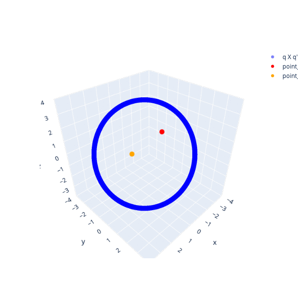

# Rotations Using Group Operations

The rotation group for a fixed distance from the origin is a hollow sphere. A
group operation takes as input two members of the group to generate a third:

```
    q * q' = q''
```

This process can be repeated over and over, each time generating a new member
of the group. If one only uses two quaternions as input, q and q', the hollow
sphere cannot be covered. Only by introducting a random element is it possible.

A characteristic of this group operation is that the scalar does not change.
One might think that changing it from a small value of 0.1 to 5.0 would be a
rather dull exercise. The result is actually odd:


When the scalar which I think of as time is smallest, one sees a circle in
space. I expected to always see that. In all these images, no matter what the
value of time happens to be, it is the same for all points. The circle
gravitates to the second red point of the two points used using in the group
operation. The circle also gets smaller. The circle splits into 6 parts,
eventually forming a star. The slight bend in the star is because all points
are on the same hollow sphere. The 6 arms start to curl. The curling leads to a
spiral.

I wonder in all the years this group operation has been around if anyone else
has noted a role for the scalar term. This exercise needed some 60k points so
is only available via a computer. The lesson I take away is that one should
not underestimate how time playing directly with space can be odd. It is fun 
visually.


